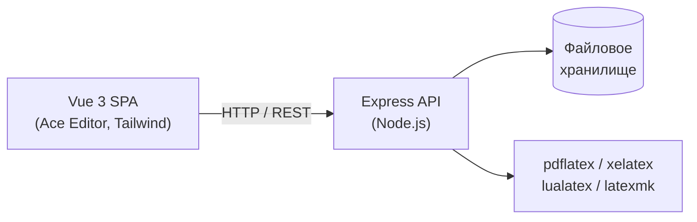

# LetuTEX

Веб-редактор LaTeX в стиле Overleaf. Полнофункциональный редактор с компиляцией, предпросмотром PDF, историей версий, шаблонами и системой совместного доступа.

## Архитектура



Приложение использует слоистую архитектуру:

- **Presentation** — Express-маршруты (`server/routes/`)
- **Application** — сервисный слой (`server/services/`)
- **Domain** — валидация, сущности (`server/domain/`)
- **Infrastructure** — хранилище, компилятор (`server/infrastructure/`)

Подробнее: [docs/architecture.md](docs/architecture.md)

## Возможности

### Редактор
- Ace Editor с подсветкой синтаксиса LaTeX
- Расширенное автодополнение команд и окружений (триггер по `\`)
- Пользовательские сниппеты (LatexToolbar + localStorage)
- Folding по `\begin`/`\end` и секциям
- Навигация по структуре документа (outline)
- Переход к определению команды (Ctrl+Click)
- Автодополнение `\cite{}` по ключам из `.bib`

### Компиляция
- pdfLaTeX, XeLaTeX, LuaLaTeX — выбор в настройках проекта
- latexmk при наличии, fallback на прямой вызов компилятора
- Поддержка BibTeX/Biber (через latexmk или явный вызов)
- Опциональная компиляция в Docker-контейнере (`USE_DOCKER_COMPILE=true`)
- Лог с разбором ошибок, клик по ошибке → переход в редактор
- SyncTeX: клик в PDF → строка в редакторе

### Управление проектами
- CRUD проектов, клонирование
- Иерархия файлов и папок (дерево в сайдбаре)
- Загрузка файлов (drag-and-drop), загрузка ZIP
- Скачивание проекта как ZIP
- Главный файл (main_file), переименование, удаление
- История версий файлов с восстановлением

### Шаблоны
- 5 готовых шаблонов: статья, отчёт, ГОСТ-отчёт, Beamer, диссертация
- Создание проекта из шаблона

### Совместный доступ
- Владелец + соавторы (роли read / write)
- Приглашение по имени пользователя

### UI/UX
- Палитра ЛЭТИ, glass morphism, адаптивная вёрстка
- Toast-уведомления, модальные окна, контекстное меню
- Горячие клавиши (Ctrl+S, Ctrl+Enter, Quick Open)
- Авто-компиляция с debounce

## Требования

- **Node.js** 18+
- **TeX Live** (или MiKTeX) — команды `pdflatex`, `latexmk` в PATH
- Опционально: **Docker** для изолированной компиляции

## Установка и запуск

### Быстрый старт

```bash
git clone <repo-url> leti-latex-editor
cd leti-latex-editor
cp .env.example .env        # настроить при необходимости
npm install
npm run build               # сборка Vue → dist/
npm start                   # Express на порту 8000
```

Откройте http://localhost:8000. Демо-вход: логин `demo`, пароль `demo`.

### Режим разработки

```bash
# Терминал 1: Express API (порт 8000)
npm run dev

# Терминал 2: Vite dev server (порт 5173, proxy → 8000)
npm run dev:frontend
```

### Docker

```bash
docker compose up --build
```

## Переменные окружения

| Переменная | По умолчанию | Описание |
|---|---|---|
| `PORT` | `8000` | Порт HTTP-сервера |
| `DATA_DIR` | `./data` | Каталог данных (проекты, пользователи) |
| `SECRET_KEY` | `change-me-in-production` | Секрет для подписи cookie |
| `COMPILE_TIMEOUT_SECONDS` | `60` | Таймаут компиляции (секунды) |
| `MAX_FILE_SIZE_BYTES` | `1048576` | Максимальный размер файла (байты) |
| `MAX_PROJECTS_PER_USER` | `50` | Лимит проектов на пользователя |
| `USE_DOCKER_COMPILE` | `false` | Компиляция в Docker-контейнере |
| `DOCKER_TEX_IMAGE` | `texlive/texlive:latest` | Docker-образ TeX Live |
| `ALLOWED_ORIGINS` | `*` | CORS origins (через запятую) |

Полный пример: [.env.example](.env.example)

## API

### Аутентификация

| Метод | Путь | Описание |
|---|---|---|
| POST | `/api/auth/register` | Регистрация |
| POST | `/api/auth/login` | Вход |
| POST | `/api/auth/logout` | Выход |
| GET | `/api/auth/me` | Текущий пользователь |

### Проекты

| Метод | Путь | Описание |
|---|---|---|
| GET | `/api/projects` | Список проектов |
| POST | `/api/projects` | Создать проект |
| GET | `/api/projects/:id` | Детали проекта (файлы, дерево) |
| PATCH | `/api/projects/:id` | Обновить (имя, main_file, compiler) |
| DELETE | `/api/projects/:id` | Удалить проект |
| POST | `/api/projects/:id/clone` | Клонировать |
| GET | `/api/projects/:id/collaborators` | Список соавторов |
| POST | `/api/projects/:id/collaborators` | Добавить соавтора |
| DELETE | `/api/projects/:id/collaborators/:uid` | Удалить соавтора |

### Файлы

| Метод | Путь | Описание |
|---|---|---|
| POST | `/api/projects/:id/files` | Создать файл |
| POST | `/api/projects/:id/folders` | Создать папку |
| POST | `/api/projects/:id/upload` | Загрузить файлы (multipart) |
| POST | `/api/projects/:id/upload-zip` | Загрузить и распаковать ZIP |
| GET | `/api/projects/:id/files/*` | Содержимое файла |
| PUT | `/api/projects/:id/files/*` | Сохранить файл |
| PATCH | `/api/projects/:id/files/*` | Переименовать |
| DELETE | `/api/projects/:id/files/*` | Удалить |

### Компиляция и скачивание

| Метод | Путь | Описание |
|---|---|---|
| POST | `/api/projects/:id/compile` | Компилировать |
| GET | `/api/projects/:id/output.pdf` | Скачать PDF |
| GET | `/api/projects/:id/download` | Скачать ZIP проекта |
| GET | `/api/projects/:id/synctex-inverse` | SyncTeX (PDF → source) |
| GET | `/api/projects/:id/definitions` | Определения команд |
| GET | `/api/projects/:id/bib-keys` | Ключи цитирования |

### История

| Метод | Путь | Описание |
|---|---|---|
| GET | `/api/projects/:id/files/*/history` | Версии файла |
| GET | `/api/projects/:id/files/*/history/:vid` | Содержимое версии |
| POST | `/api/projects/:id/files/*/restore` | Восстановить версию |

### Служебные

| Метод | Путь | Описание |
|---|---|---|
| GET | `/api/health` | Health check |
| GET | `/api/templates` | Список шаблонов |

## Структура проекта

```
leti-latex-editor/
├── server/                  # Backend (Express)
│   ├── index.js             # Точка входа
│   ├── config.js            # Конфигурация
│   ├── exceptions.js        # Ошибки приложения
│   ├── domain/
│   │   └── validation.js    # Валидация путей, расширений, парсинг ошибок
│   ├── infrastructure/
│   │   ├── compileRunner.js # Запуск pdflatex/latexmk/Docker
│   │   ├── fileStore.js     # Файловое хранилище
│   │   ├── projectRepository.js
│   │   └── userStore.js     # Хранилище пользователей
│   ├── middleware/
│   │   └── auth.js          # Аутентификация
│   ├── routes/              # REST-маршруты
│   │   ├── auth.js
│   │   ├── compile.js
│   │   ├── download.js
│   │   ├── files.js
│   │   ├── history.js
│   │   ├── projects.js
│   │   └── templates.js
│   └── services/            # Бизнес-логика
│       ├── bibKeysService.js
│       ├── compileService.js
│       ├── definitionsService.js
│       ├── fileService.js
│       ├── projectService.js
│       └── synctexService.js
├── src/                     # Frontend (Vue 3)
│   ├── main.js
│   ├── App.vue
│   ├── router/index.js
│   ├── assets/style.css     # Tailwind + кастомные стили
│   ├── components/
│   │   ├── AceEditor.vue
│   │   ├── AppHeader.vue
│   │   ├── LatexToolbar.vue
│   │   ├── ModalDialog.vue
│   │   ├── PdfPreviewSync.vue
│   │   └── ProjectCard.vue
│   ├── composables/
│   │   ├── latexCompletions.js
│   │   ├── useApi.js
│   │   ├── useAuth.js
│   │   ├── useCustomSnippets.js
│   │   ├── useEditor.js
│   │   └── useToast.js
│   └── views/
│       ├── AccountView.vue
│       ├── EditorView.vue
│       ├── LandingView.vue
│       ├── LoginView.vue
│       └── NotFoundView.vue
├── templates/               # LaTeX-шаблоны
│   ├── article/
│   ├── beamer/
│   ├── gost-report/
│   ├── report/
│   └── thesis/
├── tests/                   # Тесты (Vitest)
│   ├── server/
│   └── client/
├── docs/                    # Документация
│   ├── architecture.md
│   ├── deployment.md
│   ├── user-guide.md
│   └── plan-overleaf-competitor.md
├── .github/workflows/ci.yml # CI pipeline
├── Dockerfile
├── docker-compose.yml
├── package.json
├── vite.config.js
├── vitest.config.js
├── eslint.config.js
├── .prettierrc
├── .env.example
└── .gitignore
```

## Тестирование

```bash
npm test                # запуск всех тестов
npm run test:watch      # watch-режим
npm run test:coverage   # с покрытием
```

Тесты разделены на:
- **Backend unit** — валидация, сервисы (`tests/server/`)
- **Backend integration** — API-тесты через supertest (`tests/server/routes/`)
- **Frontend unit** — composables, компоненты (`tests/client/`)

## Линтинг и форматирование

```bash
npm run lint            # проверка ESLint
npm run lint:fix        # автоисправление
npm run format          # форматирование Prettier
```

## Развёртывание

Подробная инструкция: [docs/deployment.md](docs/deployment.md)

Краткие шаги для production:
1. Установить Node.js 18+ и TeX Live
2. Клонировать репозиторий, `npm install`, `npm run build`
3. Настроить `.env` (обязательно сменить `SECRET_KEY`)
4. Запустить через systemd или Docker
5. Настроить Nginx reverse proxy + SSL

## Документация

- [Архитектура](docs/architecture.md)
- [Развёртывание](docs/deployment.md)
- [Руководство пользователя](docs/user-guide.md)
- [План развития](docs/plan-overleaf-competitor.md)

## О проекте

Проект разработан в рамках производственной практики в СПбГЭТУ «ЛЭТИ».

## Лицензия

Распространяется под лицензией [MIT](LICENSE).
