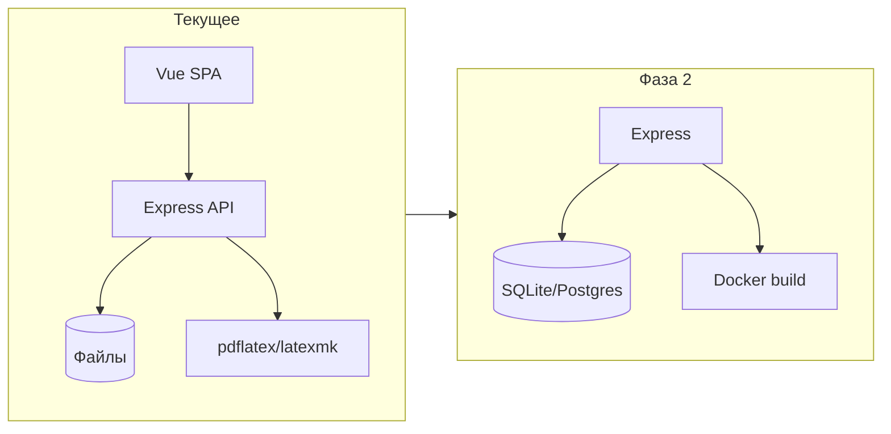

# План развития: аналог Overleaf (LaTeX Editor ЛЭТИ)

Документ сопоставляет функциональность Overleaf с текущим проектом, фиксирует разрывы и предлагает поэтапный план достижения конкурентоспособного уровня для университетской инсталляции (self-hosted, дипломная работа).

---

## Текущий стек и возможности проекта

- **Backend:** Node.js, Express, слоистая архитектура ([docs/architecture.md](architecture.md)), файловое хранилище, [server/infrastructure/compileRunner.js](../server/infrastructure/compileRunner.js) (pdflatex/latexmk).
- **Frontend:** Vue 3, Vite, Ace Editor, Tailwind; редактор, превью PDF, лог компиляции, оглавление, история версий файла, шаблоны из папки, клонирование проекта, скачивание ZIP.
- **Auth:** простой user store (логин/регистрация), без ролей и коллаборации.

---

## 1. Редактор LaTeX — разрыв и план

| Возможность Overleaf                   | Сейчас                           | Действие                                                                        |
| -------------------------------------- | -------------------------------- | ------------------------------------------------------------------------------- |
| Подсветка синтаксиса                   | Есть (Ace, mode-latex)           | —                                                                               |
| Автодополнение команд/окружений        | Базовое (Ace)                    | Расширить: словарь LaTeX-команд и окружений, триггер по `\`                     |
| Snippets                               | Есть (LatexToolbar)              | Добавить настраиваемые/пользовательские сниппеты                                |
| Проверка орфографии                    | Нет                              | Опция: браузерный spellcheck или интеграция Hunspell (сложнее)                  |
| Folding структуры                      | Нет                              | Добавить: Ace fold по `\begin`/`\end` или кастомные маркеры                     |
| Поиск/замена (regex)                   | Ace встроен                      | Проверить UX, вынести в явное модальное окно при необходимости                  |
| История изменений                      | Есть (файловая история, restore) | Уже закрыто                                                                     |
| Навигация по структуре (outline)       | Есть в сайдбаре                  | —                                                                               |
| Переход к определению команды          | Нет                              | Фаза 2: парсинг `\newcommand`/`\def` в проекте, Ctrl+click / "Go to definition" |
| Несколько файлов проекта               | Есть                             | Поддержка папок: сейчас плоский список; добавить иерархию/папки в API и UI      |
| Drag-and-drop ресурсов (pdf, png, bib) | Нет                              | Загрузка файлов в проект (API upload + UI), вставка `\includegraphics`/пути     |

**Приоритет фазы 1:** автодополнение LaTeX, folding, папки в проекте, загрузка файлов (drag-and-drop). Орфография и "go to definition" — фаза 2.

---

## 2. Live Preview и компиляция

| Возможность                             | Сейчас                                   | Действие                                                                                                               |
| --------------------------------------- | ---------------------------------------- | ---------------------------------------------------------------------------------------------------------------------- |
| Ручная компиляция                       | Есть                                     | —                                                                                                                      |
| Автокомпиляция                          | Есть (флаг "Авто")                       | Дебаунс уже есть; при желании — настраиваемый интервал                                                                 |
| SyncTeX (source ↔ PDF)                  | Частично: `-synctex=1` генерируется      | Реализовать: парсинг .synctex.gz, клик в PDF → строка в редакторе; клик в редакторе → позиция в PDF (сложнее в iframe) |
| pdfLaTeX                                | Есть                                     | —                                                                                                                      |
| XeLaTeX / LuaLaTeX                      | Нет                                      | Добавить выбор компилятора в настройках проекта (main_file + compiler), в compileRunner — ветка по типу                |
| LaTeX → DVI → PS → PDF                  | Нет                                      | Низкий приоритет для университета                                                                                      |
| Логи, error highlighting, jump-to-error | Есть (лог, разбор ошибок, клик → строка) | Улучшить парсинг ошибок (файл + строка), подсветить полосу в редакторе                                                 |

**Приоритет фазы 1:** выбор компилятора (pdfLaTeX / XeLaTeX / LuaLaTeX). Фаза 2: SyncTeX (двусторонняя синхронизация).

---

## 3. Коллаборация (core Overleaf)

| Возможность                                  | Сейчас | Действие                                                                                                                    |
| -------------------------------------------- | ------ | --------------------------------------------------------------------------------------------------------------------------- |
| Редактирование в реальном времени (OT/CRDT)  | Нет    | Требует отдельный сервис синхронизации (ShareDB, Yjs, Custom OT), WebSocket, переработка модели "один редактор — один файл" |
| Цветовые курсоры, комментарии, track changes | Нет    | Зависит от коллаборативного слоя                                                                                            |

**Вывод:** полный real-time collaboration — отдельный большой блок (архитектура, конфликты, права). Для университетского диплома разумно оформить как **цель фазы 3** или как "будущее расширение" с выбором: упрощённый сценарий (один редактор на проект + очередь сохранений) или полноценный OT/CRDT с отдельным сервисом.

---

## 4. Управление проектами

| Возможность               | Сейчас               | Действие                                                                                    |
| ------------------------- | -------------------- | ------------------------------------------------------------------------------------------- |
| Многофайловая архитектура | Есть                 | —                                                                                           |
| Папки                     | Нет (плоский список) | Добавить: пути с `/` в API (уже частично через path), дерево в UI (сайдбар), создание папок |
| Главный файл (root)       | Есть (main_file)     | —                                                                                           |
| Upload/download ZIP       | Download есть        | Upload ZIP (распаковка в проект) — фаза 1                                                   |
| Git / Dropbox / GitHub    | Нет                  | Фаза 3 или внешняя интеграция                                                               |

**Приоритет фазы 1:** папки в проекте (бэкенд + UI), загрузка ZIP в проект.

---

## 5. Шаблоны и библиотека

| Возможность               | Сейчас                                                                                       | Действие                                                                                                                    |
| ------------------------- | -------------------------------------------------------------------------------------------- | --------------------------------------------------------------------------------------------------------------------------- |
| Шаблоны из папки          | Есть ([server/routes/templates.js](../server/routes/templates.js), создание проекта из шаблона) | —                                                                                                                           |
| Галерея (тысячи шаблонов) | Нет                                                                                          | Курируемый набор в `templates/` + описание в manifest; для диплома достаточно 5–10 шаблонов (статья, отчёт, Beamer, thesis) |
| Клонирование шаблона      | Есть (создание проекта из template_id)                                                       | —                                                                                                                           |
| Share template            | Нет                                                                                          | Низкий приоритет (экспорт шаблона в ZIP)                                                                                    |

**Приоритет:** пополнить папку шаблонов 3–5 готовыми шаблонами и описать в плане.

---

## 6. Библиография

| Возможность              | Сейчас                                                  | Действие                                                                                      |
| ------------------------ | ------------------------------------------------------- | --------------------------------------------------------------------------------------------- |
| BibTeX / BibLaTeX        | Файлы .bib разрешены, компиляция через latexmk/pdflatex | Поддержка bibtex/biber в пайплайне (latexmk обычно подтягивает)                               |
| Встроенный менеджер .bib | Нет                                                     | Фаза 2: простой редактор/просмотр .bib в UI или хотя бы подсветка и автодополнение для ключей |
| Zotero/Mendeley          | Нет                                                     | Фаза 3                                                                                        |

**Приоритет:** убедиться, что компиляция с .bib стабильна (latexmk); при необходимости явно вызывать bibtex/biber в [compileRunner.js](../server/infrastructure/compileRunner.js).

---

## 7. Комментарии и научная коллаборация

Комментарии в тексте, обсуждения, теги, assign review — требуют модели данных (аннотации к диапазонам символов/строк) и UI. Разумно отнести к **фазе 3** после стабилизации редактора и опционально коллаборации.

---

## 8. Интеграции

Git/GitHub, reference managers, cloud storage — фаза 3 или пост-диплом. Для диплома достаточно: экспорт ZIP, выбор компилятора, шаблоны.

---

## 9. Пользователи и права

| Возможность                   | Сейчас                 | Действие                                                                                                              |
| ----------------------------- | ---------------------- | --------------------------------------------------------------------------------------------------------------------- |
| Владелец проекта              | Есть (owner в проекте) | —                                                                                                                     |
| Collaborator / read-only      | Нет                    | Фаза 2: таблица project_collaborators (project_id, user_id, role: read/write), проверка в middleware, UI "пригласить" |
| Link sharing, invite by email | Нет                    | Фаза 3                                                                                                                |
| Team projects                 | Нет                    | Фаза 3                                                                                                                |

**Приоритет фазы 2:** роли доступа к проекту (read/write) для одного владельца + соавторы.

---

## 10. Сборка и sandbox

| Возможность                  | Сейчас                              | Действие                                                                                                            |
| ---------------------------- | ----------------------------------- | ------------------------------------------------------------------------------------------------------------------- |
| Компиляция в процессе        | spawn pdflatex/latexmk              | —                                                                                                                   |
| Таймаут                      | Есть (config.compileTimeoutSeconds) | —                                                                                                                   |
| Контейнеризация / изоляция   | Нет (локальный процесс)             | Для продакшена университета: запуск в Docker-контейнере с TeX Live (образ + volume с проектом), ограничения CPU/RAM |
| Ограничение доступа к файлам | Нет                                 | В контейнере — только каталог проекта                                                                               |

**Приоритет фазы 2:** опция компиляции в Docker (конфиг "useDocker: true", образ с latexmk). Фаза 1 можно оставить локальный процесс.

---

## 11. Математика и графика

- AMS, equation environments: поддерживаются самой TeX-средой; в редакторе — улучшить сниппеты и автодополнение для math.
- TikZ, PSTricks, pgfplots: работают при наличии пакетов в TeX Live; проверка на типовых шаблонах.
- Preview math fragments: отдельная фича (рендер куска в боковую панель); фаза 3.
- Загрузка изображений (png, pdf): см. п. 1 (drag-and-drop).

---

## 12. Presentation mode (Beamer)

Превью Beamer как PDF уже есть. Слайд-навигация, speaker notes в UI — фаза 3 (при необходимости).

---

## 13. Экспорт и публикация

- PDF export: есть (скачивание).
- Source export (ZIP): есть ([server/routes/download.js](../server/routes/download.js)).
- Publisher submission, arXiv: не в scope диплома.

---

## 14. Архитектура (технический слой)

Текущая архитектура — монолит Express + файловое хранилище. Для конкурентоспособного аналога Overleaf в рамках диплома:

- Сохранить монолит; при необходимости вынести компиляцию в отдельный worker (очередь + Redis или in-memory) и/или Docker.
- База данных: опционально миграция метаданных проектов/пользователей в SQLite или PostgreSQL для масштабирования и прав доступа (фаза 2).
- Real-time: только при реализации коллаборации (фаза 3).

---

## 15. Self-hosted и развёртывание

Уже учтено: университетская инсталляция, [docs/deployment.md](deployment.md), systemd. Дополнительно: описание Docker-based сборки (образ Node + статика, volume данных, опционально отдельный образ компиляции), Nginx, при необходимости LDAP/SSO (фаза 3).

---

## Итоговые фазы внедрения

**Фаза 1 (ядро "аналог Overleaf" для диплома)**  

- Редактор: расширенное автодополнение LaTeX, folding, папки в проекте, загрузка файлов (drag-and-drop), вставка путей.  
- Компиляция: выбор компилятора (pdfLaTeX / XeLaTeX / LuaLaTeX).  
- Проекты: дерево файлов/папок в UI, загрузка ZIP в проект.  
- Шаблоны: 3–5 шаблонов в репозитории.  
- Проверить компиляцию с .bib.

**Фаза 2 (качество и безопасность)**  

- Права доступа: соавторы проекта (read/write).  
- Компиляция в Docker (sandbox).  
- SyncTeX: клик по PDF → строка в редакторе.  
- Опционально: миграция метаданных в БД.

**Фаза 3 (расширения)**  

- Реальное время (OT/CRDT) или упрощённая "очередь редактирования".  
- Комментарии в документе.  
- Git-интеграция, LDAP/SSO — по необходимости.

---

## Todo-задачи (разбивка плана)

### Фаза 1

1. **phase1-autocomplete** — Расширить автодополнение LaTeX (словарь команд и окружений, триггер по `\`).
2. **phase1-folding** — Добавить folding структуры в Ace по `\begin`/`\end`.
3. **phase1-folders-backend** — Папки в проекте: бэкенд (пути с `/`, дерево файлов в API).
4. **phase1-folders-ui** — Папки в проекте: UI (дерево в сайдбаре, создание папок).
5. **phase1-upload-api** — API загрузки файлов в проект (multipart upload).
6. **phase1-upload-ui** — UI drag-and-drop загрузки и вставка `\includegraphics`/пути.
7. **phase1-zip-upload** — Загрузка ZIP в проект (распаковка в каталог проекта).
8. **phase1-compiler-choice** — Выбор компилятора: pdfLaTeX / XeLaTeX / LuaLaTeX (настройки проекта + compileRunner).
9. **phase1-snippets** — Настраиваемые/пользовательские сниппеты (опционально).
10. **phase1-templates** — Добавить 3–5 готовых шаблонов в `templates/` (статья, отчёт, Beamer, thesis).
11. **phase1-bib** — Проверить и при необходимости доработать компиляцию с .bib (latexmk/bibtex/biber).
12. **phase1-save-plan-doc** — Сохранить план в `docs/plan-overleaf-competitor.md`.

### Фаза 2

1. **phase2-collaborators** — Соавторы проекта: модель (project_collaborators), middleware, UI «пригласить» (read/write).
2. **phase2-docker-compile** — Опция компиляции в Docker (useDocker, образ TeX Live, sandbox).
3. **phase2-synctex** — SyncTeX: парсинг .synctex.gz, клик в PDF → строка в редакторе.
4. **phase2-error-parsing** — Улучшить парсинг ошибок (файл + строка), подсветка полосы в редакторе.
5. **phase2-goto-definition** — Переход к определению команды (`\newcommand`/`\def`), Ctrl+click.
6. **phase2-bib-manager** — Простой редактор/просмотр .bib или подсветка и автодополнение ключей.
7. **phase2-db-optional** — Опционально: миграция метаданных проектов/пользователей в SQLite или PostgreSQL.

### Фаза 3

1. **phase3-realtime** — Real-time коллаборация (OT/CRDT) или упрощённая очередь редактирования.
2. **phase3-comments** — Комментарии в документе (модель аннотаций, UI).
3. **phase3-git** — Git-интеграция (по необходимости).
4. **phase3-ldap-sso** — LDAP/SSO (по необходимости).

---

## Фаза 3 — дорожная карта (по необходимости)

Следующие пункты запланированы как расширения и реализуются по необходимости:

- **Real-time коллаборация**: отдельный сервис синхронизации (ShareDB, Yjs, Custom OT), WebSocket, переработка модели «один редактор — один файл». Альтернатива: упрощённая очередь сохранений (один редактор на проект, блокировка при открытии).
- **Комментарии в документе**: модель аннотаций (привязка к диапазону символов/строк в файле), хранение в `project_id/file_path/annotations.json` или в БД, UI панели комментариев и маркеров в редакторе.
- **Git-интеграция**: опциональный слой (инициализация репозитория в каталоге проекта, коммиты по кнопке, просмотр истории), интеграция с GitHub/GitLab — по требованию.
- **LDAP/SSO**: замена логина/пароля на корпоративную аутентификацию (Passport.js + стратегия LDAP/SAML), по требованию университета.

---

## Сохранение плана в проекте

Этот документ сохранён в **docs/plan-overleaf-competitor.md** и является частью проектной документации и основой для постановки задач.
